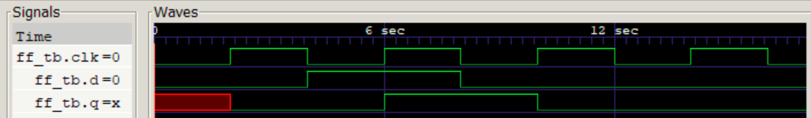

Brief intro to Verilog
======================

This document is a brief intro to Verilog, and in conjunction with
the examples and exercises should give you enough knowledge to
develop and test your CPU. This is given as a written document
than a lecture simply because students usually prefer this kind
of content more as a resource they can return to. There are 
also extra sources of information linked at the end of this
document.

To develop your MIPS CPU and test-bench you need to use a relatively
small set of Verilog constructs. These can be split into two groups:

- **Synthesizable** : language constructs which can be synthesised into
    concrete digital logic with well defined semantics.

- **Non-synthesizable** language constructs which only work in simulation,
    and either have no hardware equivalent or ambiguous hardware semantics.

Synthesisable constructs can be used both in your digital circuit and
in the test-bench testing that circuit, but non-synthesisable constructs
can only be used in the test-bench. Beware: you may or may not get a
warning/error when trying to synthesise a non-synthesisable construct.

More time is given to discussing test-benches, as testing circuits is
often a more complex and subtle problem than designing them.


Synthesisable constructs
========================

This is a brief summary of some synthesisable constructs you are
likely to need, along with some suggestions. This list is not
exhaustive (see the references at the end), and you may need to
perform your own research and experimentation.

Signal types
------------

You may be aware of the `wire` and `reg` types from classic Verilog
(these were used in DECA in places). However, you are strongly
encouraged to use the newer `logic` type from SystemVerilog because:

- Usually you can just declare everything as `logic` and the compiler
  will work it out.

- Using `logic` activates certain warning and error messages, particularly
  in combination with `always_comb` and `always_ff`.

To declare a single bit signal, just use `logic`.

To declare a multi-bit signal, use `logic[msb:0]`, where
`msb` is an integer. The total width of the signal is `msb+1`.

Hierarchy Management
--------------------

You need two main constructs to manage your hierarchy:

- **Module definition** : declare a new module, including it's
    name, input and output ports, and the internal structure.

- **Module instantiation** : create an instance of an existing
    module by name, then binding the inputs and outputs to
    existing signals.

Examples of both were given in lecture 1 (developing the
hierarchy of MIPS), and lecture 2 (ALU implementation),
and should be sufficient for our purposes here.

While module instantiation is similar to function calls,
it is important to remember that the hierarchy is static.
The hierarchy is expanded once at compile/synthesis time,
as the complete set of resources (gates and wires) must
be known in order to construct the circuit. This contrasts
with the function call stack in software which is
dynamic - the call graph will expand and contract at
run-time, with different function calls re-using the
same memory.

Combinatorial logic and blocking assignments
--------------------------------------------

Combinatorial logic takes two main forms:

- `assign`
- `always_comb`

Which approach you use to describe combinatorial logic is a matter
of preference, though usually `assign` makes more sense for simple
wiring (e.g. basic maths or multiplexors), while `always_comb` is
useful for complex statements involving `if ... else ...` statements.

In an `always_comb` block you should always use _blocking_ assignment,
of the form `signal = expression;`:
```verilog
    always_comb begin
        if (x==0) begin
            a_n=1;
        else
            a_n=a+1;
        end
    end
```

These are called "blocking" because the right-hand-side of the assignment
is evaluated and the assignment completed before any more statements are
executed. So the idea is that each statement runs to completion and "blocks"
following assignments until it is done. 

You should try to be disciplined in `always_comb` blocks in order to
avoid errors and weirdness. Some good tips are:

- Any variable being assigned should be assigned exactly once on any path
    through the code.  For example, in the above code `a_n` is assigned
    once in the `if` branch, and once in the `else` branch - only one
    branch can be true at any given time, so there is a single assignment
    to `a_n` on each path through the code.

- Do not refer to the same signal on both the left- and right-hand size
    of a blocking assignment in `always_comb`. This can be understood
    by considering what the statement `assign a = a + 1;` synthesises to
    (e.g. draw a picture of the circuit).
    You should usually be able to split signals in an `always_comb`
    block into two sets:

    - Those that are assigned to : likely to include flip-flop inputs and module outputs;
    - Those that are read from : likely to include flip-flop outputs and module inputs.
  
These guidelines can be violated - even in high quality code - but it
is best to stick to simple rules until you understand the trade-offs
involved.

Sequential logic and non-blocking assignment
--------------------------------------------

Sequential logic can use a number of forms, but you are encouraged
to use the `always_ff` block, which should only contain "non-blocking"
assignments using the `<=` assignment operator.
```verilog
    always_ff @(posedge clk) begin
       a <= a_n;
    end
```
This can be interpreted as "assign the value of a_n to a at each clock edge.",
and is essentially turning `a` into a flip-flop.

Note that the above example `always_ff` block naturally pairs with the example `always_comb`
block in the previous section:

- The combinatorial block prepares the next value `a_n` based on the flip-flop `a`.
- The flip-flop block assigns `a_n` to the flip-flop `a` at the clock edge.

Some people find this complete separation between combinatorial and sequential
logic useful, and it can help to keep things safe. However, you can relax
things in some sequential blocks where the logic is relatively simple.

The assignment is called "non-blocking" because each statement does not
affect the following statements. You can think of it as if all of the
right-hand-side expressions are evaluated in parallel, then all the assignments
to the left-hand-side signals happen. As a consequence you can refer to the
same variable on both sides of a non-blocking assignment. So we could
simplify the above combination of combinatorial and sequential blocks
into just one sequential block:
```verilog
    always_ff @(posedge clk) begin
        if (x==0) begin
            a <= 1;
        else
            a <= a+1;
        end
    end
```
This is just a design choice - you can also choose to keep sequential
and combinatorial logic completely separate.

Non-Synthesisable Constructs
============================

The set of non-synthesisable constructs is very large, as SystemVerilog added a lot
of language features related to testing and verification. This is not too
surprising, given how much time a digital engineer spends on testing circuits
and trying to prove they are correct. We will only touch on a few of the
features here, though these are sufficient to write moderately complex test-benches
for CPUs.

Test-benches
------------

A test-bench is just a module with no inputs or output ports. Instead the
test-bench produces output by printing output during simulation, or by
producing waveforms for later inspection. Test-benches can also read and write files, which
can be used to initialise RAMs or record selected outputs to a file.
Inside the test-bench you can instantiate other modules, include the
synthesisable module you actually want to test - this is often called the
Design Under Test (DUT), or Circuit Under Test (CUT).

Printing values
---------------

In a test-bench you can print output at any point in time, using the
[`$display`](https://verilog.renerta.com/source/vrg00013.htm) command
introduced in the previous session.
This command uses a format string, similar to the C [`printf`](http://www.cplusplus.com/reference/cstdio/printf/)
function, which allows you to embed the values of signals and choose
whether they should be shown as decimal or hexadecimal:
```verilog
$display("The value of x is %d in decimal, and %h in hex", x, x);
```
This output will be printed to the `stdout` of the simulator, and
so can be captured as a file and post-processed if necessary.


Initial blocks and delays
-------------------------

An `initial` block starts execution at the beginning of the simulation,
and the statements in the block are executed one by one. These statements
can consist of standard synthesisable statements like assignments and
if statements, but can also include non-synthesisable statements like
`while` and `for` loops to simplify test-bench logic. The simulator
executes as many statements as possible, and only stops when it reaches
some sort of timing control statement, such as:

- `#n;` : delay control - wait for `n` time units.
- `@(posedge sig);` : event control - wait until a rising edge on `sig`.
- `wait (expr);` wait statement - wait until expression `expr` is true.

You can have as many `initial` blocks as you want, and they will all
start executing at the start of the simulation. However,
only one block will ever execute in the simulator at once, and if
there are two blocks which are ready to continue execution the
simulator will pick one arbitrarily. As a consequence, you should
avoid situations where two blocks compete to execute if they
both read and write the same signals.

One way of managing multiple blocks is to split `initial` blocks
into two types: timing driven blocks, and event driven blocks.
For example:
```verilog
module testbench();
    logic x;

    /* First process that is using time based delay */
    initial begin
        x=0;
        #4;   /* Delay for 4 timeunits */
        x=1;
        #3;   /* Delay for 3 timeunits */
        x=0;
        #2; /* Delay for 2 timeunits */
        x=1;
        #1; /* Delay for 1 timeunit */
        x=0;
    end

    /* Second process that is using edge sensitive events.*/
    initial begin
        @(posedge x);
        $display("x went high at time %t", $time);

        @(negedge x);
        $display("x went low at time %t", $time);

        @(posedge x);
        $display("x went high at time %t", $time);

        @(negedge x);
        $display("x went low at time %t", $time);
    end
endmodule
```
This test-bench can be compiled and executed, and will print:
```
x went high at time                    4
x went low at time                    7
x went high at time                    9
x went low at time                   10
```

This example is safe because the timed block is "driving" the
event-driven block.

Generating a clock
------------------

There is no inherent clock in Verilog, so it must be generated within
the test-bench. This can be accomplished using timed delays. For example,
this generates three cycles of a clock with a period of 2 time units:
```verilog
initial begin
    clk = 0;
    #1; 
    clk = 1;
    #1;
    clk = 0;
    #1;
    clk = 1;
    #1;
    clk = 0;
    #1;
    clk = 1;
end
```

However, if you want to simulate millions of cycles then this gets quite long...
An alternative approach is to use the `forever` construct, which simply repeats
a statement or block forever. This initial block generates an infinite clock
with a period of 2 time units:
```verilog
initial begin
    forever begin
        clk = 0;
        #1; 
        clk = 1;
        #1;
    end
end
```

Infinitely running test-benches can be a problem if the DUT fails
in some way, and so never completes some expected task. For
example, you might write a CPU test-bench with the expectation that
the CPU will complete execution in 10 instructions. If the CPU does
not finish within 1000 cycles, then it is probably _never_ going to
finish, so we might as well abort the test-bench. This is particularly
important if you want to run tens or hundreds of test-benches, as
one runaway test-bench means the entire batch doesn't complete.

A way of addressing this is to use a combination of `repeat for`
to generate a fixed number of clock cycles, then [`$fatal`](http://svref.renerta.com/sv00079.htm) to
exit the simulation if nothing else has finished it:
```verilog
initial begin
    repeat(1000) begin
        clk = 0;
        #1; 
        clk = 1;
        #1;
    end

    $fatal(2, "Test-bench has not completed after 1000 clock cycles. Giving up.");
end
```
In another block the test-bench checking block can call [$finish](https://verilog.renerta.com/mobile/source/vrg00042.htm)
once the DUT has completed the expected tasks. 

An advantage of using `$finish` and `$fatal` is that they make it much easier
to run and manage test-benches using scripts:

- If `$finish` is called, the simulator returns a success code (i.e. the program returns 0).
- If `$fatal` is called, the simulator returns a failure code (i.e. the program returns non zero).

You will often find discussion online that implies that people are spending lots of
time running a single simulation using a GUI tools, such as the ModelSim GUI interface, or
the built-in Quartus simulation tool you used in DECA. However, in real-world
practise you typically have tens or hundreds of tests for a given circuit,
some of which are very slow. You don't want to manually run each test-bench
then look at the output, so clearly indicating whether a test-bench passed
or failed using the simulator return code is very useful, as then you
can run them from a script. The only time you start looking at waveforms
is if the test-bench is not passing, and you need to go in and fix it.

Clocked test-benches
--------------------

Verilog has some slightly odd simulation semantics, so it makes testing
a clocked circuit harder than it could be. A particular problem is
around the ordering of statements in multiple blocks, where two
blocks are ready to execute at the same time.
For example, consider the module `ff` and its test-bench `ff_tb`:

```verilog
module ff(input logic clk, output logic q, input logic d);
    always_ff @(posedge clk) begin  
        q <= d;
    end
endmodule

module ff_tb();
    logic clk, d, q;

    /* Clock generator */
    initial begin 
        clk=0;
        repeat (10) begin
            #2;
            clk=!clk;
        end
        $finish(0);
    end

    /* Module under test */
    ff dut(.clk(clk), .d(d), .q(q));

    /* Non-synthesisable test-bench */
    initial begin 
        d=0;
        @(posedge clk);
        assert(q==0);

        d=1;
        @(posedge clk);
        assert(q==1);

        d=0;
        @(posedge clk);
        assert(q==0);
    end
endmodule
```
The `ff` module is completely correct, but the test-bench will report
that it fails, as the first two assertions do not hold. Looking at
the waveform shows why at least one of them is failing:


If you look at the waveforms at t=6 (shown with the white line), the
input d has fallen, but the `ff` output `q` did not change with the rising
edge. The problem here is that the test-bench is doing two sequential
things on the falling edge:

1. Asserting that the output `q` has the correct value.
2. Immediately changing the input `d`.

Because only one thing can happen at a time, the simulator has done
both these steps _before_ it runs `q<=d` in the `ff` module. Essentially
we have not met the hold time for the flip-flip, as the test-bench
changes it too soon after the clock-edge (the simulator doesn't
really model hold times, but this is a useful analogy).

One way of fixing this is to apply an offset between the clock edge
and the assertion:
```verilog
    d=0;             /* Change the input before the rising edge. */
    @(posedge clk);  /* Wait for rising edge... */
    #1;              /* then delay by one time-unit */
    assert(q==0);    /* Check the output once it has settled */

    d=1;             /* Change the input (still one unit after clock) */
    @(posedge clk);
    #1;
    assert(q==1);
```
The test-bench now passes, and we get a different simulated waveform:


```

The offset approach can be a little fragile, as it means you need to
know how fast the simulated clock is. When your DUT is a positive
edge triggered circuit (as is usually the case), an alternative approach is to
simply move the test-bench onto the negative edge:
```verilog
    d=0;
    @(negedge clk);
    assert(q==0);

    d=1;
    @(negedge clk);
    assert(q==1);
```

Regardless of how fast the clock is, this approach always has the
test-bench testing outputs and modifying inputs on the negative
edge, while the DUT performs it's non-blocking register updates
on the positive edge.

In order to manage the problem of ordering, it is often useful to
split your test-bench into four parts:

1. A clock generator using `initial`. This is the only block which uses
    explicit time-delay, with everything else being clock sensitive.
2. A test-bench block using `initial`. This is the thing sensitive to
    the negative clock edge, and performs all checking of outputs and
    setting of inputs.
3. The DUT module, synchronous to the positive clock edge.
4. (Optional) Any other helper modules, such as RAMs, ROMs, or counters.
    These should ideally be synthesisable, and sensitive to the positive edge.

Using this approach you minimise the potential for problems:

- The clock generator does not depend on anything, and drives the whole simulation.
- The test-bench logic is the only negative edge sensitive logic, making it
    easy to check whether signals are checked before they are modified, and
    guaranteing any flip-flops are stable.
- All other logic is "just" clock synchronous logic. There may still be errors
    in it, but they won't be related to simulation ordering.

These are only suggestions, and many other approaches are possible (and
even used in the examples I give you), but
you should be aware of the potential complications if you end up
having many blocks which mix delays and event triggers.

Simulated time
--------------

In the above I have talked about delaying for a certain number
of time-units, and the time-scale in the waveforms is shown
in seconds. A 1hz clock is clearly unrealistic, but in terms
of a functional simulation of a clock synchronous digital circuit,
the clock-rate doesn't matter at all. We could ask the simulator
to run the clock at 1THz, and it would still produce exactly
the same waveforms, just with a different time-scale on the x-axis.

When writing test-benches our focus is on functional correctness: given
infinitely fast perfect logic gates, is our simulation correct? Combinatorial
logic will be simulated with zero propagation delay, with the only
requirement being that the simulator logic is causal - the output of
a combinatorial operator will not change until and unless it's inputs
change.

Timing aspects of clocked synchronous circuits are generally avoided (though
it is sometimes done), for a few reasons:

- Simulating exact timing details of a circuit makes the simulator run much slower;
- Logic timing is inherently random, with each gate having a slightly different
    delay each time it switches;
- Making correctness conditional on timing means that we only know it is correct
    on one target technology (e.g. one specific FPGA family). Ideally we would
    like our circuit to run correctly in any FPGA, as well as in ASICs.

Timing is usually a separate step performed using vendor tools, and happens
after functional correctness is demonstrated using a test-bench. Ultimately
timing is sub-ordinate to correctness - what is the point of making a
circuit faster if it doesn't work? If the circuit does not meet timing
then you can start to optimise it, but your test-bench still remains critical
to ensure that your optimisations haven't broken it.

If you want to change the simulated time-unit, you can
do that using [timeunit](http://svref.renerta.com/sv00029.htm).
There are two things that can be changed:

- unit : this determines what 1 means in `#1`.
- precision : this determines how finely the simulated time is split up.

For example, you might say:
```
timescale 1 ns/10 ps
```
Which means that the unit is 1ns, while the minimum representable simulated
time is 10ps. Choosing a finer resolution than the time-unit allows you
to specific fractional delays, while if the time unit and scale are
equal (the default) you can only specific integer delays.

But be aware that it has no effect on whether your circuit might
meet timing in any particular FPGA, nor does it (usually) change the way
the circuit simulates. 

Other Information
=================

While SystemVerilog has been around a long time, a lot of references and guides
still treat Verilog as the core, and SystemVerilog as a recent extension. As
a consquence you'll often see older Verilog constructs mixed with newer (and
safer) SystemVerilog constructs.

A useful [cheat-sheet](https://www.cl.cam.ac.uk/teaching/1011/ECAD+Arch/files/SystemVerilogCheatSheet.pdf)
of synthesisable SystemVerilog.

A slightly bigger [mini reference](https://web.stanford.edu/class/ee183/handouts_win2003/VerilogQuickRef.pdf)
that I found quite useful, though it is focused on Verilog.

If you want a more comprehensive set of tutorials, then I find the Doulos set
of articles useful, though longer:

- [Verilog Articles](https://www.doulos.com/knowhow/verilog/)
- [SystemVerilog tutorials](https://www.doulos.com/knowhow/systemverilog/systemverilog-tutorials/)
- [SystemVerilog for FPGAs](https://www.doulos.com/knowhow/systemverilog/using-systemverilog-for-fpga-design/)

Another good focussed set of tutorials is the ["VerilogGuide"](https://verilogguide.readthedocs.io/en/latest). Apart
from knowing it is by someone called Meher Krishna Patel ( who appears to be at Xilinx), I don't know a lot about
provenance, but generally I've found it reliable and well written.

There are a number of well-known problems with Verilog - it is quite a hostile
language to users, due to the number of corner cases and sharp edges. You
can get a sense of these problems from [this presentation](https://sutherland-hdl.com/papers/2006-SNUG-Boston_standard_gotchas_presentation.pdf).
One of you may wish to read the presentation, as it may help you to debug other
people's problems.
Note that Verilog has so many edge cases that Sutherland and Mills have written a complete book called "101
Verilog Gotchas". 

You probably don't need to read a text-book to do this coursework, as you should mainly
be at the level of translating diagrams into RTL, then writing simple test-benches.
I have no particular opinion on text-books, but one that is freely available
from the library as an e-book is "SystemVerilog for Hardware Description: RTL Design and Verification", Vaibbhav Taraate.